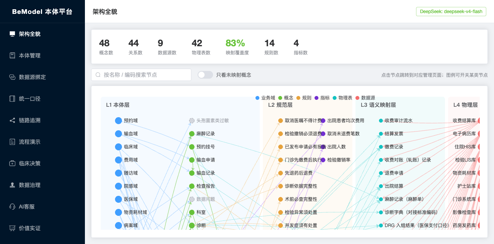
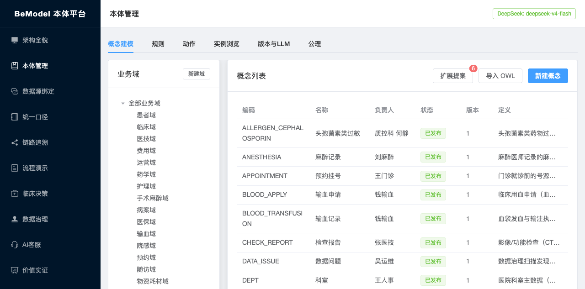
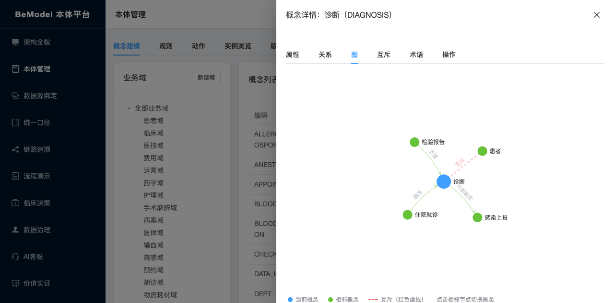
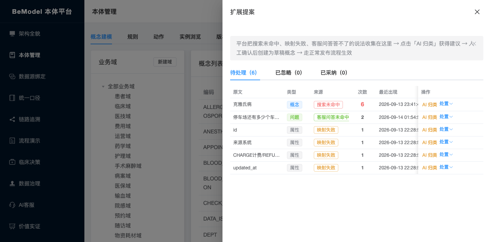
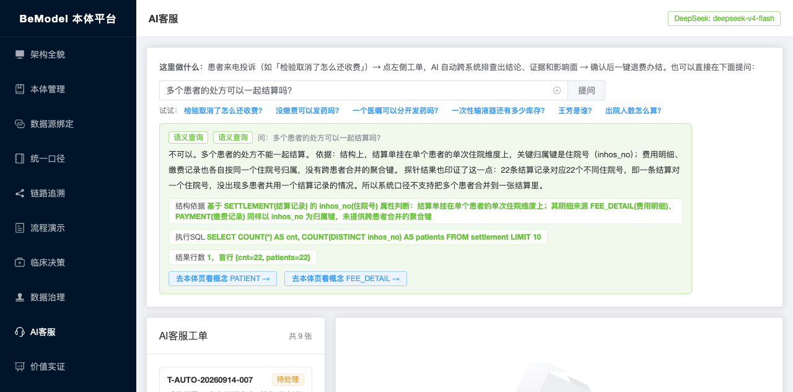
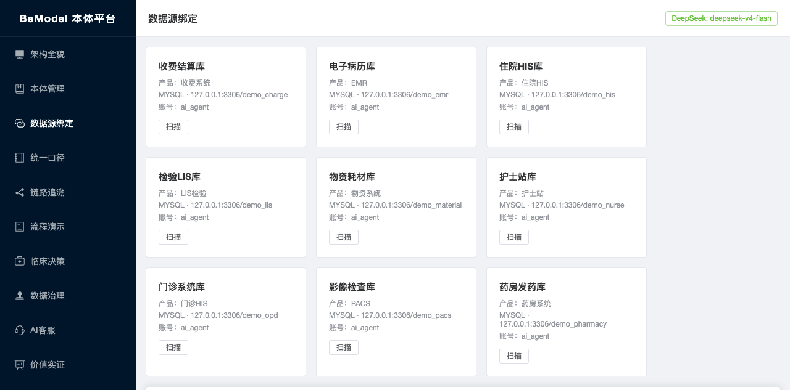
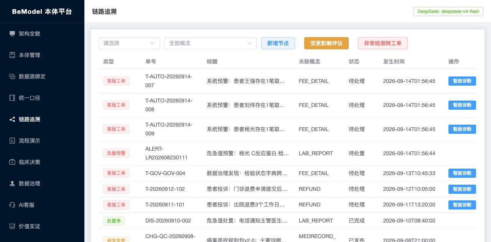
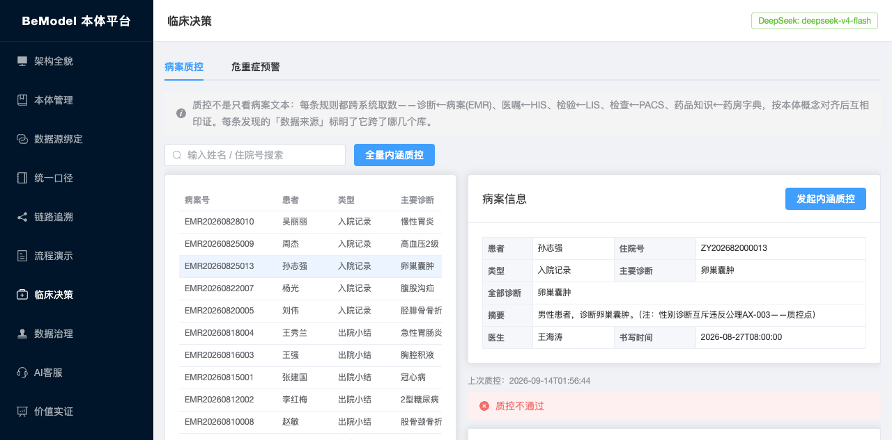
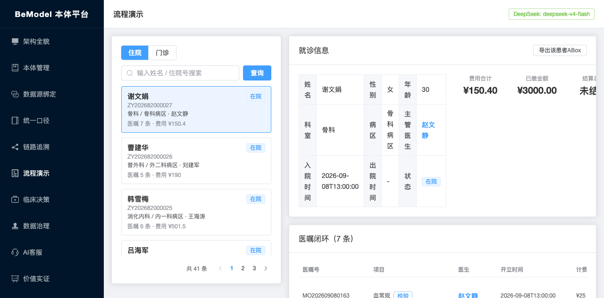

# BeModel 本体建模平台

> 一句话定位：把医院九套业务系统（HIS / LIS / PACS / EMR / 药房 / 收费 / 门诊 / 护士站 / 物资）的数据**不搬家、不复制**，通过「本体 + 映射」建成统一的语义层，让规则引擎和 AI 都能直接基于业务语义工作。

BeModel 是一个语义层（Semantic Layer）平台：数据留在各业务库里，平台只维护「概念 → 属性 → 物理表列」的映射与值字典，在此之上提供本体建模、版本化发布、规则/指标口径管理、链路追溯、病案质控、根因分析和 AI 客服等能力。

设计哲学：**物理自治、逻辑统一**——避开数据搬迁和图数据库的成本，语义层随使用持续生长。

## 核心能力

- **架构全貌**：L1 本体层 / L2 规范层 / L3 语义映射层 / L4 物理层四层结构实时渲染，映射覆盖度一目了然，点击节点跳转对应管理页面
- **本体建模**：业务域 → 概念 → 关系，公理（对称 / 传递 / 互逆 / 互斥）结构化存储；OWL 导入（预览与落库同一计划）、Turtle ABox 导出（Apache Jena）
- **发布门禁**：一键打整体不可变快照；发布前自动跑本体自检（对称且反对称、互逆不成对、互斥自身等 7 类缺陷），BLOCKER 拒绝发布
- **数据源绑定与映射**：注册业务库连接，扫描 information_schema 建物理快照；物理列 ↔ 概念属性逐列绑定（AI 推荐、人工确认），值字典归一
- **AI 客服 × 语义层**：
  - 事实问题走 **Ontology2SQL**——LLM 基于本体映射生成 SQL，白名单安全校验后真实执行，证据栏展示 SQL 与数据源，数字只来自业务库
  - 规则类「能不能」问题从本体结构推理作答，并自动跑数据探针实证
  - 答不了的问题自动记入**扩展提案**，AI 归类建议 → 人工采纳 → 草稿 → 发布，形成本体增长回路
- **治理与追溯**：病案内涵质控八类规则跨库执法；链路追溯双向 BFS 还原每笔异常的来龙去脉；影响分析、根因分析（RCA）一键处置
- **LLM 合规链路**：统一 LLM 网关（DeepSeek），每次调用落审计表并绑定本体版本号；AI 不可用时自动降级为规则 / 模板，演示不断链

## 技术栈

| 端 | 技术 |
|---|---|
| 后端 | Java 21 · Spring Boot 3.3 · MyBatis-Plus · Flyway · Apache Jena |
| 前端 | Vue 3 · Vite · Element Plus · ECharts · Pinia |
| 存储 | MySQL（平台元数据库 + 各业务演示库） |
| AI | DeepSeek（API Key 走环境变量，无 Key 全链路可降级演示） |

## 目录结构

```
bemodel-java
├── bemodel-server              # 后端（Spring Boot）
│   ├── pom.xml
│   └── src
│       ├── main
│       │   ├── java/com/bemodel
│       │   │   ├── BeModelApplication.java
│       │   │   ├── architecture/   # 架构全貌（四层结构实时渲染、覆盖度统计）
│       │   │   ├── ontology/       # 本体层：业务域 / 概念 / 指标 / 术语 / OWL 导入
│       │   │   ├── modeling/       # 规范层：规则 / 动作 / 公理结构化 / 版本发布与门禁
│       │   │   ├── datasource/     # 数据源注册、连接管理与 information_schema 扫描
│       │   │   ├── instance/       # 语义映射：概念属性 ↔ 物理表列、值字典
│       │   │   ├── link/           # 链路追溯（双向 BFS 还原异常链路）
│       │   │   ├── impact/         # 变更影响分析
│       │   │   ├── governance/     # 数据治理扫描（GovRule / GovScan / GovIssue）
│       │   │   ├── clinical/       # 临床决策：病案内涵质控 + 危重症预警
│       │   │   ├── rca/            # 根因分析（RCA）与处置
│       │   │   ├── cs/             # AI 客服：意图路由 + 语义问答（Ontology2SQL）
│       │   │   ├── search/         # 语义搜索
│       │   │   ├── value/          # 价值实证
│       │   │   ├── flow/           # 流程演示（业务闭环）
│       │   │   ├── rdf/            # OWL / Turtle 导出（Apache Jena）
│       │   │   ├── llm/            # LLM 网关：DeepSeek 客户端、审计日志
│       │   │   ├── seed/           # 演示数据生成器（启动自动播种，幂等）
│       │   │   ├── common/         # 统一返回 / 异常 / 状态机
│       │   │   └── config/         # CORS 等配置
│       │   └── resources
│       │       ├── application.yml # 配置（账号密码全部走环境变量）
│       │       └── db/migration/   # Flyway 迁移（V1~V23，含本体与种子数据）
│       └── test/java/com/bemodel   # 单元测试（ontology / modeling / clinical / cs 等）
├── bemodel-web                 # 前端（Vue 3 + Vite）
│   ├── index.html
│   ├── vite.config.js          # dev 代理 /api → 127.0.0.1:18080
│   ├── package.json
│   └── src
│       ├── api/                # axios 接口封装
│       ├── router/ store/ layout/ components/ utils/
│       └── views/              # 页面：architecture / ontology / datasource / glossary
│                               #       link / flow / clinical / gov / cs / value
└── docs/screenshots/intro/     # README 界面截图
```

## 界面截图

### 架构全貌

L1~L4 四层结构实时渲染（查询出来，不是静态图）：概念 48 / 关系 44 / 数据源 9 / 物理表 42 / 映射覆盖度 83%，未映射概念灰色弱化，点击节点跳转管理页。



### 本体管理

业务域 → 概念 → 关系，公理结构化存储；概念详情含邻域关系图与互斥约束可视化。



### 概念邻域图

概念「诊断」的邻域图：支撑检验报告、可能触发感染上报，与「患者」的互斥约束以红色虚线标出。



### 扩展提案（本体增长回路）

搜索未命中、映射失败、客服问答未命中三类信号汇入同一提案池，按次数排序，AI 归类建议 → 人工采纳 → 草稿 → 发布。



### AI 客服语义问答

问「多个患者的处方可以一起结算吗？」——结构依据来自本体公理，探针 SQL 实时验证，路由方式（规则路由 / AI 归类 / 语义查询）标签可见。



### 数据源绑定

注册九个业务库连接，一键扫描 information_schema 建物理快照。



### 链路追溯

双向 BFS 还原每笔异常的来龙去脉：医嘱 → 计费 → 缴费 → 发药 / 检验全链路可视。



### 病案内涵质控

八类规则跨库执法（如「男性患者诊断卵巢囊肿」命中性别互斥公理 AX-003），每条发现标注跨了哪几个库、引用了哪条规则与公理。



### 流程演示

业务闭环演示：入院 → 医嘱 → 计费 → 缴费 → 检验 / 发药 → 出院结算。



## 快速开始

环境要求：JDK 21+、Maven 3.9+、MySQL 8、Node 18+（推荐 pnpm）。

```bash
# 1. 配置环境变量（数据库账号密码必填；账号需有建库权限，首次启动会自动建库建表）
export MYSQL_USERNAME=your_mysql_user
export MYSQL_PASSWORD=your_mysql_password
export DEEPSEEK_API_KEY=sk-xxxx        # 可选；不配置则 LLM 能力自动降级为规则/模板

# 2. 启动后端（Flyway 自动建表 + DataSeeder 自动生成演示数据）
cd bemodel-server
mvn spring-boot:run                    # http://127.0.0.1:18080

# 3. 启动前端
cd bemodel-web
pnpm install
pnpm dev                               # http://127.0.0.1:5173
```

首次启动说明：

- Flyway 自动执行 V1~V23 迁移，创建平台元数据库表结构与本体种子数据
- `DataSeeder` 自动生成九个演示业务库（demo_charge / demo_emr / demo_his / demo_lis / demo_material / demo_nurse / demo_opd / demo_pacs / demo_pharmacy），含 40 名**虚构**患者的住院医嘱全闭环数据，并预埋若干「取消未退费」类数据裂缝供质控与追溯演示；数据确定性可重复，幂等跳过
- 未配置 `DEEPSEEK_API_KEY` 时，AI 相关能力自动降级（关键词路由 / 模板作答），平台功能不中断

## 环境变量

| 变量 | 必填 | 默认值 | 说明 |
|---|---|---|---|
| `MYSQL_USERNAME` | 是 | — | 平台库用户名（需有建库权限） |
| `MYSQL_PASSWORD` | 是 | — | 平台库密码 |
| `MYSQL_HOST` | 否 | `127.0.0.1` | MySQL 主机 |
| `MYSQL_PORT` | 否 | `3306` | MySQL 端口 |
| `MYSQL_DATABASE` | 否 | `bemodel_platform` | 平台元数据库名 |
| `DEEPSEEK_API_KEY` | 否 | — | DeepSeek API Key；不配置则自动降级 |

> 安全约定：API Key、数据库账号密码只走环境变量，不落入仓库（`.gitignore` 已排除 `.env*`）。

## 当前边界

- 演示数据为平台自建的九套 demo 库，尚未接入真实产品线；接上真实库的只读连接后，同样的映射、探针与问答即可工作
- 暂无认证授权（无登录 / RBAC），生产化部署前需补齐
- LLM 依赖 DeepSeek API，需自行配置 Key 并注意调用审计（平台已落 `llm_log` 审计表）

## License

[Apache License 2.0](LICENSE)
